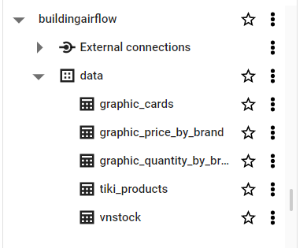

# [Python + Airflow] Build data pipeline

## Introduction

Bài toán: Build a data pipeline using Airflow for the purpose of automating the entire data flow

**Yêu cầu**: 

1. Extract data:
  Setup flow load data from MySql and Mongodb to GCS.
2. Transform data:
  Automatically create tables and schemas on BigQuery (via Airflow) and convert GCS data into BigQuery.
3. Load data:
  All dashboards that require visualization in old projects need to be rewritten in SQL, save the information to be visualized in another table and Data Studio will read the results from there to show the dashboard. Setup Airflow and automatically update dashboard at 7am every day
## Demo

   
  <i>Data in GCS</i>

   
  <i>Data in Bigquery</i>

   
  <i>Airflow pipeline</i>

